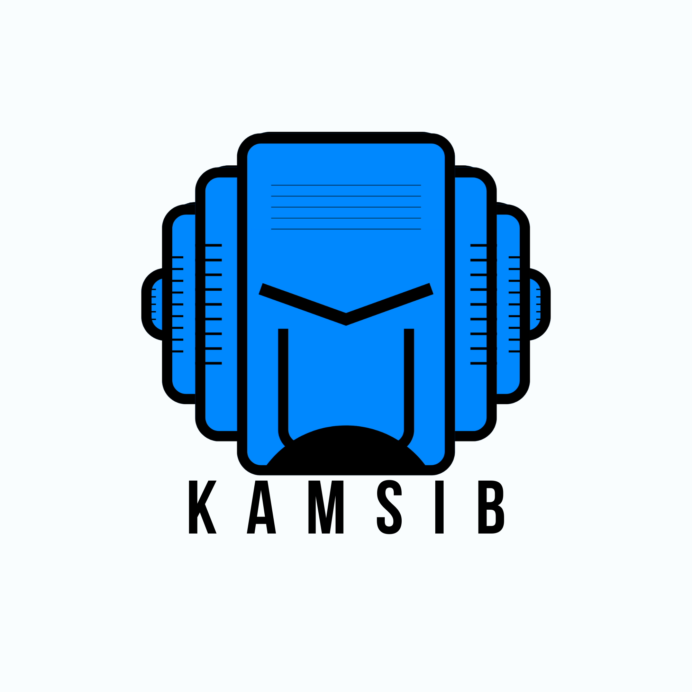

# Kamar Kamsib - Keamanan Siber Indonesia

  

  
  
  

  
  
  
  

---

### 🛡️ Tentang Kamar Kamsib
**Kamar Kamsib (Kamsib Indonesia)** adalah platform edukasi keamanan informasi dan siber terpercaya di Indonesia. Didirikan pada 21 Mei 2021 oleh Lepari, visi kami adalah memajukan kesadaran dan literasi siber di Indonesia dengan moto utama: **"Penuhi Asupan Keamanan Siber Setiap Hari."**

---

### 🚀 Ekosistem Platform Kami

| Platform | Deskripsi | Akses Sekarang |
| :--- | :--- | :--- |
| 🌐 **Kamsib Portal** | Pusat layanan keamanan profesional, konsultasi siber, program kemitraan, artikel/blog, dan rekaman webinar edukasi terbaru. | [kamsib.id ➜](https://kamsib.id) |
| 🛡️ **Kamsib App** | Platform belajar cybersecurity interaktif secara gratis! Akses materi fundamental, latihan interaktif, dan terminal emulator langsung di browser. | [app.kamsib.id ➜](https://app.kamsib.id) |
| 🏁 **Kamsib CTF** | Platform kompetisi dan simulasi Capture The Flag untuk melatih keterampilan hacking Anda dalam skenario dunia nyata. | [ctf.kamsib.id ➜](https://ctf.kamsib.id) |

---

### 🎓 Apa yang Bisa Kamu Pelajari di Kamsib App?

Di [Kamsib App](https://app.kamsib.id), kami menyediakan laboratorium belajar siber interaktif dengan berbagai modul esensial:
*   🗝️ **CIA Triad:** Landasan utama perlindungan informasi (*Confidentiality*, *Integrity*, *Availability*).
*   🔐 **Autentikasi & Otorisasi:** Cara sistem memverifikasi identitas dan mengatur izin akses.
*   🎣 **Phishing & Social Engineering:** Memahami taktik manipulasi psikologis pelaku kejahatan siber.
*   🐛 **Web Security & SQL Injection:** Memahami kerentanan web dan cara memitigasinya.
*   🔌 **Network Fundamentals:** Belajar cara kerja protokol komunikasi, port, dan monitoring lalu lintas data.
*   💻 **Linux & Windows CLI:** Uji coba langsung perintah sistem operasi populer lewat terminal emulator.
*   💡 **Security Best Practices:** Penerapan MFA, Password Manager, HTTPS, enkripsi, serta privasi data.

---

### 💼 Layanan Profesional Kamsib
Untuk organisasi, perusahaan, atau instansi pendidikan yang ingin memperkuat pertahanan digitalnya, kami menyediakan:
1.  **Pengujian Keamanan Sistem (Penetration Testing):** Audit terstruktur untuk menemukan celah keamanan sebelum disalahgunakan peretas.
2.  **Pelatihan Keamanan Siber (Cybersecurity Training):** Edukasi komprehensif untuk meningkatkan kesadaran siber (*cyber awareness*) karyawan Anda.
3.  **Simulasi Keamanan Siber & CTF:** Platform custom untuk kompetisi internal atau rekrutmen praktisi keamanan informasi.

👉 [Hubungi kami untuk kolaborasi atau konsultasi gratis](https://wa.me/62881011730807?text=Halo%20Kamsib%2C%20saya%20ingin%20berkonsultasi%20tentang%20layanan%20Anda.)

---

  Dikelola oleh tim profesional <b>Kamsib Indonesia</b>. Hubungi kami melalui email: <a href="mailto:hubungi@kamsib.id">hubungi@kamsib.id</a>.

